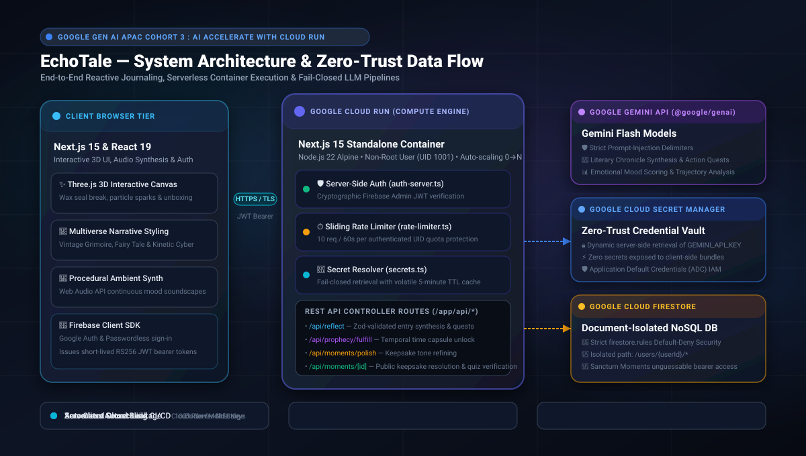

# EchoTale — Personal Gemini Journal & Sanctum Keepsakes

[](https://cloud.google.com/run)
[](https://aistudio.google.com/)
[](https://nextjs.org/)
[](https://firebase.google.com/)
[](LICENSE)

> **Built for the Google Gen AI APAC Cohort 3: AI Accelerate with Cloud Run Hackathon**  
> An intelligent, zero-trust reflective journal and sealed digital keepsake platform powered by **Google Gemini**, **Google Cloud Run**, **Google Cloud Secret Manager**, and **Cloud Firestore**.

---

## 1. Project Overview & Hackathon Purpose

### The Inspiration
Journaling is one of the most effective tools for mental clarity, personal growth, and emotional grounding. However, existing digital journaling tools suffer from two major shortcomings:
1. **The Blank Page / Echo Chamber Trap**: Traditional journals record text passively without offering meaningful narrative synthesis or perspective. Conversely, naive AI chatbots often generate generic sycophantic praise or unsolicited amateur clinical diagnoses.
2. **Data Privacy & Ephemeral Moments**: Intimate thoughts are either locked away and forgotten or exposed to insecure cloud storage. Furthermore, there is no meaningful way to transform personal memories into enduring, interactive gifts for loved ones.

### The Solution: EchoTale
**EchoTale** transforms daily raw thoughts into a living chronicle while maintaining absolute data privacy:
- **Narrative Synthesis**: Powered by the **Google Gemini API** (`@google/genai`), EchoTale synthesizes raw thoughts into literary chronicle chapters while grounding every word strictly in what the writer provided.
- **Dual-View Guarantee**: Raw personal drafts remain permanently untouched and preserved side-by-side with AI-synthesized chapters.
- **Sanctum Moments**: Users can encapsulate cherished memories into unboxable 3D keepsakes (`/m/[id]`), featuring interactive Three.js wax seal breaking, memory trivia quizzes, photo lightboxes, and ambient procedural audio.
- **Temporal Prophecies**: Cryptographic time capsules that seal personal reflections until a designated unlock date in the future.

---

## 2. Google Cloud Technologies Used

EchoTale is built natively to showcase Google Cloud's modern application stack:

| Google Cloud Product | Purpose & Implementation |
| :--- | :--- |
| **Google Cloud Run** | **Serverless Container Execution**: Hosts the Next.js 15 standalone production container with autoscaling from 0 to N instances, HTTP/2 multiplexing, non-root hardened execution, and minimal memory footprint. |
| **Google Gemini API** | **AI Narrative Engine**: Leverages Gemini Flash models via `@google/genai` TypeScript SDK for prompt-injection shielded reflection synthesis, emotional sentiment scoring, and tone refinement. |
| **Google Cloud Secret Manager** | **Zero-Trust Credential Security**: Server-side dynamic retrieval of sensitive keys (`GEMINI_API_KEY`, Firebase Service Accounts) with in-memory TTL caching and strict fail-closed enforcement. |
| **Cloud Firestore** | **Document-Level Isolated Persistence**: Real-time scalable NoSQL database configured with strict default-deny security rules that isolate entries strictly to authenticated owners. |
| **Firebase Authentication** | **Identity Layer**: Secure Google Sign-In and Email/Password flows, cryptographically verified on every server request using `firebase-admin/auth`. |
| **Google Cloud Build & Artifact Registry** | **Automated CI/CD**: Seamless container builds (`cloudbuild.yaml`) pushing versioned images directly to Artifact Registry for automated Cloud Run deployments. |

---

## 3. Architecture & System Design



---

## 4. Key Features

### 📖 The Living Chronicle & Dual-View Journaling
- **Side-by-Side Fidelity**: Original journal entries remain unchanged; the AI creates a reflective synthesis chapter alongside it.
- **Narrative Grounding**: The Gemini prompt constitution guarantees that reflections stay strictly tethered to the writer's authentic experiences, never inventing facts or diagnosing mental health.
- **Emotional Mood Analysis**: Generates mood scores and descriptive sentiment labels to track personal trajectory over time.

### 🎁 Sanctum Moments (`/m/[id]`)
- **Interactive 3D Unboxing**: Recipients break a custom Three.js wax seal, solve memory trivia mini-games, and read personal letters.
- **Multiverse Aesthetic Themes**:
  1. *Vintage Grimoire* — Aged parchment textures, magical glowing ink, and wax seal aesthetics.
  2. *Fairy Tale Love* — Celestial glowing starfield and whimsical warmth.
  3. *Kinetic Cyber* — High-contrast neon matrix and mechanical core styling.
- **Procedural Ambient Audio**: In-browser Web Audio API synthesizer generates calming procedural ambient background music tailored to each theme.

### ⏳ Temporal Prophecies (Time Capsules)
- Encrypt and lock reflections until a designated date in the future.
- When the date arrives, Gemini generates a "fulfillment synthesis" analyzing the time elapsed and personal evolution.

---

## 5. Security & Zero-Trust Architecture

EchoTale applies defense-in-depth principles across every layer:

| # | Threat Vector | Defense Mechanism | Implementation |
|---|---------------|-------------------|----------------|
| **1** | **Unauthenticated API Access** | Mandatory Server-Side JWT Verification | [`lib/auth-server.ts`](file:///c:/Users/Lenovo/OneDrive/Desktop/Project/Nextjs/EchoTale/lib/auth-server.ts): Every protected route validates the Firebase ID token using `firebase-admin/auth`. |
| **2** | **Cross-User IDOR Tampering** | Strict Default-Deny Firestore Rules | [`firestore.rules`](file:///c:/Users/Lenovo/OneDrive/Desktop/Project/Nextjs/EchoTale/firestore.rules): Reads/writes verify `request.auth.uid == userId`. API routes never trust client-supplied UIDs. |
| **3** | **Secret Exfiltration** | Server-Side GCP Secret Manager | [`lib/secrets.ts`](file:///c:/Users/Lenovo/OneDrive/Desktop/Project/Nextjs/EchoTale/lib/secrets.ts): `GEMINI_API_KEY` is fetched server-side from Secret Manager and never exposed to the client. |
| **4** | **Prompt Injection Attacks** | Untrusted Data Boundary Isolation | [`app/api/reflect/route.ts`](file:///c:/Users/Lenovo/OneDrive/Desktop/Project/Nextjs/EchoTale/app/api/reflect/route.ts): User input is strictly wrapped in content delimiters and marked as passive data. |
| **5** | **Resource Abuse / DoS** | Sliding-Window Rate Limiter | [`lib/rate-limiter.ts`](file:///c:/Users/Lenovo/OneDrive/Desktop/Project/Nextjs/EchoTale/lib/rate-limiter.ts): Enforces 10 requests per 60 seconds per UID. |

---

## 6. Local Setup & Cloud Run Deployment

### Local Development

1. **Clone & Install**:
   ```bash
   git clone https://github.com/Vivekkumarv123/EchoTale.git
   cd EchoTale
   npm install
   ```

2. **Configure Local Environment**:
   ```bash
   cp .env.example .env.local
   ```
   Fill in your Firebase credentials and `GEMINI_API_KEY` in `.env.local`.

3. **Start Development Server**:
   ```bash
   npm run dev
   ```
   Visit `http://localhost:3000`.

---

### Deploying to Google Cloud Run

#### Step 1: Enable Google Cloud APIs
```bash
gcloud services enable run.googleapis.com \
    cloudbuild.googleapis.com \
    artifactregistry.googleapis.com \
    secretmanager.googleapis.com
```

#### Step 2: Configure Secrets in Secret Manager
Store your API keys securely in Secret Manager:
```bash
# Store Gemini API Key
echo -n "YOUR_GEMINI_API_KEY" | gcloud secrets create GEMINI_API_KEY --data-file=- --replication-policy="automatic"

# Grant the Cloud Run service account access:
PROJECT_NUM=$(gcloud projects describe YOUR_GCP_PROJECT_ID --format="value(projectNumber)")
gcloud secrets add-iam-policy-binding GEMINI_API_KEY \
    --member="serviceAccount:${PROJECT_NUM}-compute@developer.gserviceaccount.com" \
    --role="roles/secretmanager.secretAccessor"
```

#### Step 3: Deploy via Cloud Build
```bash
gcloud builds submit --config=cloudbuild.yaml \
    --substitutions \
_FIREBASE_API_KEY="your_api_key",\
_FIREBASE_AUTH_DOMAIN="your_project.firebaseapp.com",\
_FIREBASE_PROJECT_ID="your_project_id",\
_FIREBASE_STORAGE_BUCKET="your_project.appspot.com",\
_FIREBASE_MESSAGING_SENDER_ID="your_sender_id",\
_FIREBASE_APP_ID="your_app_id"
```

#### Step 4: Authorize Domain in Firebase
Add your live Cloud Run URL (e.g., `https://echotale-xxxxx-ew.a.run.app`) to **Firebase Console** -> **Authentication** -> **Settings** -> **Authorized domains**.

---

## 7. Verification & Quality Assurance

- **Build Verification**: `npm run build` compiles all static and dynamic routes into the Next.js standalone container bundle.
- **Code Quality**: `npm run lint` enforces strict ESLint rules and TypeScript validation.
- **Container Hardening**: Tested and verified under Docker multi-stage builds running as a dedicated non-root user (`nextjs:nodejs`, UID 1001).

---

## 8. License

This project is licensed under the MIT License.
